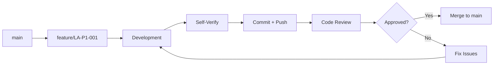

# Git Workflow and Code Review

**Last updated**: 2026-02-17

---

## 📋 Table of Contents

- [Branch Structure](#branch-structure)
- [Developer → Architect Workflow](#developer--architect-workflow)
- [Commit Conventions](#commit-conventions)
- [Code Review Process](#code-review-process)
- [Database Migrations](#database-migrations)
- [Pull Request Template](#pull-request-template)
- [Documentation Updates](#documentation-updates)

---

## Branch Structure

### Main Branch

```
main (protected)
  └── Status: Stable, documented, reviewed code
```

### Development Branches

```
feature/<task-id>-<short-description>
  └── Example: feature/LA-P1-001-useSupabaseQuery-hook
  └── Use: Development of backlog tasks

fix/<task-id>-<description>
  └── Example: fix/LA-P0-002-gitignore
  └── Use: Bug fixes

refactor/<task-id>-<description>
  └── Example: refactor/CR-P1-002-clash-api-module
  └── Use: Refactors without functional changes

docs/<description>
  └── Example: docs/update-architecture
  └── Use: Documentation updates
```

### Branch Lifecycle



---

## Developer → Architect Workflow

### Phase 1: Developer Implements Task

**1. Select task from backlog**

```bash
# Review DEVELOPMENT_BACKLOG.md
# Select next P0 or P1 task
```

**2. Create branch**

```bash
cd d:\LigaInterna
git checkout main
git pull
git checkout -b feature/LA-P1-001-useSupabaseQuery-hook
```

**3. Implement changes**

- Follow exactly the steps in the task
- Write code following acceptance criteria
- Don't introduce out-of-scope changes

**4. Self-verification**

```bash
# Run ALL verification commands listed in the task
# Example for LA-P1-001:

cd d:\LigaInterna\liga-admin

# 1. Verify file exists
Test-Path src/hooks/useSupabaseQuery.js

# 2. Verify import in component
Select-String -Path src/pages/admin/BattlesHistory.jsx -Pattern "useSupabaseQuery"

# 3. Count lines
(Get-Content src/pages/admin/BattlesHistory.jsx).Count

# 4. Run linter
npm run lint

# 5. Test in browser
# - Open http://localhost:5173/admin/battles-history
# - Verify battles load
# - etc.
```

**5. Update documentation (if applicable)**

```bash
# If task modifies architecture, update:
# - liga-admin/docs/TECHNICAL_ARCHITECTURE.md
# - cron/docs/TECHNICAL_ARCHITECTURE.md
# - .github/copilot-instructions.md
# - DEVELOPMENT_BACKLOG.md
# - openspec workflow specs
```

**6. Commit with conventional message**

```bash
git add .
git commit -m "feat(liga-admin): add useSupabaseQuery custom hook

Implements LA-P1-001:
- Create src/hooks/useSupabaseQuery.js with loading/error/data states
- Migrate BattlesHistory.jsx to use the hook
- Reduce component lines from 1353 to 1303 (-50 lines)

Acceptance criteria:
✅ Hook handles loading, error, data states
✅ Hook prevents memory leaks with cleanup function
✅ BattlesHistory.jsx uses the hook
✅ Functionality identical (no breaking changes)
✅ Linter passes

Verification:
- Test-Path src/hooks/useSupabaseQuery.js → OK
- npm run lint → 0 errors
- Browser test → Battles load correctly

Related: LA-P1-001"
```

**7. Push and notify Architect**

```bash
git push -u origin feature/LA-P1-001-useSupabaseQuery-hook

# Notify: "Task LA-P1-001 completed, branch ready for review"
```

---

### Phase 2: Architect Reviews Code

**1. Checkout branch**

```bash
cd d:\LigaInterna
git fetch
git checkout feature/LA-P1-001-useSupabaseQuery-hook
```

**2. Review changes**

```bash
# See modified files
git diff main --name-status

# See complete diff
git diff main

# See commits
git log main..HEAD --oneline
```

**3. Run automated verifications**

```bash
# Run ALL verification commands from the task
# (same ones Developer ran)

cd d:\LigaInterna\liga-admin
Test-Path src/hooks/useSupabaseQuery.js
npm run lint
# etc.
```

**4. Code Review Checklist**

**Architecture:**
- [ ] Follows patterns established in TECHNICAL_ARCHITECTURE.md?
- [ ] Doesn't introduce unnecessary dependencies?
- [ ] Doesn't break existing abstractions?
- [ ] Consistent with codebase?

**Code Quality:**
- [ ] Readable and self-explanatory?
- [ ] Descriptive variable/function names?
- [ ] Short functions with single responsibility?
- [ ] Handles errors appropriately?
- [ ] No code duplication?

**Testing:**
- [ ] All tests pass (if applicable)?
- [ ] Functionality verified manually?
- [ ] No regressions introduced?

**Documentation:**
- [ ] Code commented where necessary?
- [ ] JSDoc/docstrings on complex functions?
- [ ] Technical documentation updated?
- [ ] DEVELOPMENT_BACKLOG.md updated?

**Git:**
- [ ] Commit message follows conventions?
- [ ] Atomic changes (1 task = 1 branch)?
- [ ] No unnecessary files (logs, cache, .env)?

**5. Generate feedback**

If issues found, create a **correction task**:

```markdown
### 🔄 CR-LA-P1-001-R1: Code Review Fixes for useSupabaseQuery

**Original task**: LA-P1-001  
**Reviewer**: Architect  
**Date**: 2026-02-17

**Issues found**:

1. **Hook doesn't prevent memory leaks** (Critical)
   - File: `src/hooks/useSupabaseQuery.js` line 12
   - Problem: Missing cleanup function in useEffect
   - Required fix:
     ```javascript
     useEffect(() => {
       let cancelled = false;
       
       async function fetchData() {
         // ... existing code
         if (!cancelled) {
           setData(result);
         }
       }
       
       fetchData();
       return () => { cancelled = true; }; // ← ADD THIS
     }, dependencies);
     ```

2. **Linter warning unresolved** (Minor)
   - File: `src/pages/admin/BattlesHistory.jsx` line 45
   - Problem: `useSupabaseQuery` imported but `loading` unused
   - Fix: Destructure only used props or ignore warning

3. **Missing documentation** (Minor)
   - File: `liga-admin/docs/TECHNICAL_ARCHITECTURE.md`
   - Problem: Section 5 (Patterns) doesn't mention new hook
   - Fix: Add usage example in section "5.1 Data Fetching"

**Acceptance criteria for re-submit**:
- ✅ Cleanup function added
- ✅ Linter passes without warnings
- ✅ Documentation updated

**Verification command**:
```bash
npm run lint
Select-String -Path src/hooks/useSupabaseQuery.js -Pattern "cancelled = true"
```
```

**6. Decision**

**If approved:**
```bash
# Merge to main
git checkout main
git merge --no-ff feature/LA-P1-001-useSupabaseQuery-hook -m "Merge feature/LA-P1-001: useSupabaseQuery hook"
git push

# Mark task as DONE in backlog
# Update DEVELOPMENT_BACKLOG.md:
### ✅ [DONE] LA-P1-001: Extract useSupabaseQuery hook
**Completed**: 2026-02-17
**Commits**: 5122ad1
```

**If rejected:**
```bash
# Notify Developer with correction task
# Developer returns to Phase 1 with task CR-LA-P1-001-R1
```

---

## Commit Conventions

### Format

```
<type>(<scope>): <subject>

<body>

<footer>
```

### Types

- **feat**: New functionality
- **fix**: Bug fix
- **refactor**: Refactor without functional changes
- **docs**: Documentation changes
- **style**: Formatting, missing semicolons, etc. (not code)
- **test**: Add or modify tests
- **chore**: Build, deps changes, etc.
- **perf**: Performance improvements

### Scopes

- `liga-admin`: React app changes
- `cron`: Python sync job changes
- `docs`: General documentation changes
- `db`: Schema or migration changes
- `ci`: CI/CD changes

### Examples

```bash
# Feature
git commit -m "feat(liga-admin): add useSupabaseQuery custom hook

Implements LA-P1-001"

# Fix
git commit -m "fix(cron): add exponential backoff to API retries

Resolves CR-P0-002"

# Refactor
git commit -m "refactor(liga-admin): extract date utils to separate module

Implements LA-P1-002"

# Docs
git commit -m "docs: update TECHNICAL_ARCHITECTURE.md with new hooks pattern"

# Chore
git commit -m "chore(liga-admin): add react-hot-toast dependency"
```

---

## Code Review Process

### Developer Responsibilities

1. ✅ Implement according to acceptance criteria
2. ✅ Self-verify ALL checks
3. ✅ Update relevant documentation
4. ✅ Descriptive commit message
5. ✅ Notify when ready for review

### Architect Responsibilities

1. ✅ Review within <24 hours
2. ✅ Run automated verifications
3. ✅ Review architecture and quality
4. ✅ Generate constructive, specific feedback
5. ✅ Approve or reject with clear justification

### Issue Severity Levels

**🔴 Critical (Blocking)**
- Breaks existing functionality
- Introduces security bugs
- Memory leaks
- Grave architecture violations

**🟡 Major (Must fix)**
- Significant code smells
- Extensive code duplication
- Missing error handling
- Critical missing documentation

**🟢 Minor (Suggestion)**
- Unclear naming
- Inconsistent formatting
- Missing comments
- Optional optimizations

---

## Database Migrations

### Overview
Database schema changes are versioned SQL migrations stored in `./supabase/migrations/`. These serve both:
- **liga-admin**: React app that reads/writes battle, player, team data
- **cron**: Python sync job that ingests battle data from Clash API

**Critical**: Database changes affect both projects. Always test locally with both running.

### Workflow: Create and Test Migration

**1. Create new migration file**

```bash
cd d:\LigaInterna
supabase migration new <descriptive_name>
```

**Example**:
```bash
supabase migration new add_battle_sync_status
# Creates: supabase/migrations/20260217143022_add_battle_sync_status.sql
```

**2. Write migration SQL**

```sql
-- supabase/migrations/20260217143022_add_battle_sync_status.sql

-- Add new column to battle table
ALTER TABLE battle 
ADD COLUMN sync_status VARCHAR DEFAULT 'OK',
ADD COLUMN last_sync_attempt TIMESTAMPTZ;

-- Create index for filtering
CREATE INDEX idx_battle_sync_status ON battle(sync_status);

-- Document the change
COMMENT ON COLUMN battle.sync_status IS 
  'Status of battle data: OK, INCOMPLETE, REPAIR_QUEUED, REPAIRED, GIVE_UP';
```

**Important**:
- Make migrations **idempotent** (safe to run multiple times)
- Use `IF NOT EXISTS` / `IF EXISTS` where applicable
- Include comments explaining purpose
- Test with both `supabase db reset` and manual verification

**3. Test locally (full stack)**

```bash
# Reset local database with new migration
cd d:\LigaInterna
supabase db reset

# This:
# - Applies all migrations in order
# - Loads seed.sql data
# - Clears previous state

# Start frontend (should still work)
cd liga-admin
npm run dev      # http://localhost:5173

# Test with cron locally (if needed)
cd cron
python cron_clash_sync.py  # Should handle new columns gracefully
```

**Verification Checklist**:
- [ ] Frontend loads without errors
- [ ] No console errors in browser DevTools
- [ ] Data still loads correctly
- [ ] Cron job runs without schema errors
- [ ] New columns/tables work as expected

**4. Commit migration**

```bash
git add supabase/migrations/20260217143022_add_battle_sync_status.sql
git commit -m "db: add sync_status tracking to battle table

Implements DB-P1-001:
- Add sync_status column (OK, INCOMPLETE, REPAIRED, GIVE_UP states)
- Add last_sync_attempt timestamp for retry logic
- Create index on sync_status for filtering incomplete battles

Tested:
- supabase db reset ✅
- Frontend loads ✅
- Cron handles new columns ✅

Related: DB-P1-001"
```

**5. Update documentation**

If migration affects data models, update specs:

```bash
# Update schema documentation
vim openspec/specs/data-models.md  # Add new table/column to schema section
vim liga-admin/docs/TECHNICAL_ARCHITECTURE.md  # If liga-admin affected
vim cron/docs/TECHNICAL_ARCHITECTURE.md  # If cron affected

# Commit with migration
git add openspec/specs/data-models.md
git commit --amend                # Add to previous commit, or:
git commit -m "docs: update data-models for sync_status column"
```

**6. Code review (Architect)**

Architect verifies:
- [ ] SQL syntax correct
- [ ] Migration is idempotent
- [ ] No breaking changes for existing code
- [ ] Both liga-admin and cron tested
- [ ] Documentation updated
- [ ] Rollback strategy (if complex migration)

### Workflow: Push to Production

**⚠️ CRITICAL**: Database changes in production affect all users. Require explicit approval.

```bash
# 1. Get approval from database administrator/architect
# Notify: "Ready to push migration DB-P1-001 to production"

# 2. Backup production database (external tool)
# Supabase Dashboard → Backups → Create Backup

# 3. Push migration
cd d:\LigaInterna
supabase db push
# Prompts: "Push database migrations to project [prod-project]?"
# Type: y

# 4. Verify on production
# - Check deployed app works
# - Monitor logs for errors
# - Verify data integrity

# 5. Rollback plan (if problems)
# If migration causes issues:
# - Create reverse migration in new file
# - Or restore from backup (manual process)
# - Document what went wrong
```

### Common Migration Patterns

**Adding a column**:
```sql
ALTER TABLE players 
ADD COLUMN last_battle_time TIMESTAMPTZ;
```

**Making column required**:
```sql
ALTER TABLE players 
ALTER COLUMN last_battle_time SET NOT NULL;
```

**Adding constraint**:
```sql
ALTER TABLE battles
ADD CONSTRAINT check_positive_trophies CHECK (trophies_change >= -3000);
```

**Creating index for performance**:
```sql
CREATE INDEX idx_player_tag ON player_identity(player_tag);
CREATE INDEX idx_battle_time ON battle(battle_time DESC);
```

**Renaming column** (with backward compatibility):
```sql
-- Step 1: Create new column with data
ALTER TABLE players ADD COLUMN trophy_count INT;
UPDATE players SET trophy_count = trophies;

-- Step 2: Drop old column (in separate migration, next day)
ALTER TABLE players DROP COLUMN trophies;
```

### Migration Checklist

For every database change:

- [ ] Created via `supabase migration new`
- [ ] SQL is idempotent
- [ ] Tested with `supabase db reset`
- [ ] Frontend tested (npm run dev)
- [ ] Cron tested (if applicable)
- [ ] No data loss
- [ ] Documented with comments
- [ ] Data models spec updated
- [ ] Commit message includes task ID
- [ ] Architect approved
- [ ] Documentation updated

---

## Pull Request Template

(For future use when connected to GitHub/GitLab)

```markdown
## Task

**ID**: LA-P1-001  
**Title**: Extract useSupabaseQuery hook from BattlesHistory.jsx  
**Priority**: P1 - High

## Description

Creates reusable custom hook `useSupabaseQuery` to standardize data fetching. Eliminates duplicated code in BattlesHistory.jsx.

## Changes

- [x] Create `src/hooks/useSupabaseQuery.js`
- [x] Migrate BattlesHistory.jsx to use hook
- [x] Update technical documentation

## Modified Files

- `src/hooks/useSupabaseQuery.js` (new, +45 lines)
- `src/pages/admin/BattlesHistory.jsx` (modified, -50 lines)
- `liga-admin/docs/TECHNICAL_ARCHITECTURE.md` (updated)

## Verification

### Automated Tests
```bash
npm run lint → ✅ 0 errors
Test-Path src/hooks/useSupabaseQuery.js → ✅ True
```

### Manual Tests
- ✅ Battles load correctly
- ✅ Loading spinner appears
- ✅ Error handling works
- ✅ No regressions detected

## Screenshots

(Optional: attach if visual changes)

## Checklist

- [x] Code follows established patterns
- [x] Linter passes without warnings
- [x] Functionality preserved
- [x] Documentation updated
- [x] Conventional commit message
- [x] Self-verification completed

## Related

- Implements: `DEVELOPMENT_BACKLOG.md` LA-P1-001
- Related to: LA-P1-004 (will use this hook)
```

---

## Documentation Updates

### When to Update

**Always when:**
- You change code patterns
- Add new modules/abstractions
- Modify file structure
- Identify new issues
- Complete architecture-affecting tasks

### Which Documents to Update

| Change | Document |
|--------|----------|
| New pattern/hook/abstraction | `liga-admin/docs/TECHNICAL_ARCHITECTURE.md` section 5 |
| New Python function/module | `cron/docs/TECHNICAL_ARCHITECTURE.md` section 3 |
| Database changes | `specs/04-database-schema.md` |
| New migration | `specs/05-database-migrations.md` |
| Workflow changes | `openspec/specs/git-workflow.md` (this file) |
| AI Agent behavior | `.github/copilot-instructions.md` |
| New task/issue | `DEVELOPMENT_BACKLOG.md` |

### Update Format

**BEFORE committing:**

1. Open relevant document
2. Find affected section
3. Add/modify with code example
4. Include in same commit

**Example:**

```bash
# Implemented LA-P1-001 (useSupabaseQuery hook)

# 1. Update TECHNICAL_ARCHITECTURE.md
# Add in section 5.1:
## 5.1 Data Fetching

### Custom Hook: useSupabaseQuery

**Location**: `src/hooks/useSupabaseQuery.js`
**Use**: Standardize Supabase fetching with loading/error states

```javascript
import { useSupabaseQuery } from '../../hooks/useSupabaseQuery';

const { data, loading, error } = useSupabaseQuery(async () => {
  const { data } = await supabase.from('table').select();
  return data;
}, [dependencies]);
```

# 2. Commit everything together
git add src/hooks/useSupabaseQuery.js
git add src/pages/admin/BattlesHistory.jsx
git add liga-admin/docs/TECHNICAL_ARCHITECTURE.md  # ← Include doc
git commit -m "feat(liga-admin): add useSupabaseQuery custom hook

Implements LA-P1-001
Updated TECHNICAL_ARCHITECTURE.md section 5.1"
```

---

## Useful Commands

### View changes before commit

```bash
git status
git diff
git diff --staged
```

### View history

```bash
git log --oneline --graph
git log --author="Developer" --since="2 days ago"
git log --grep="LA-P1"
```

### Review remote branch

```bash
git fetch
git log main..origin/feature/LA-P1-001
git diff main...origin/feature/LA-P1-001
```

### Undo changes (if needed)

```bash
# Undo uncommitted changes
git restore <file>

# Undo last commit (keep changes)
git reset --soft HEAD~1

# Undo last commit (discard changes) ⚠️
git reset --hard HEAD~1
```

### Cherry-pick (apply specific commit)

```bash
git cherry-pick <commit-hash>
```

---

## Complete Visual Flow

```
┌─────────────────────────────────────────────────────────┐
│              DEVELOPMENT_BACKLOG.md                     │
│              (Prioritized Tasks)                        │
└─────────────────┬───────────────────────────────────────┘
                  │
                  ▼
         ┌────────────────┐
         │  Developer     │
         │  selects       │
         │  task P0/P1    │
         └────────┬───────┘
                  │
                  ▼
         ┌────────────────────┐
         │ git checkout -b    │
         │ feature/LA-P1-001  │
         └────────┬───────────┘
                  │
                  ▼
         ┌────────────────────┐
         │  Implement         │
         │  per task          │
         │  steps             │
         └────────┬───────────┘
                  │
                  ▼
         ┌────────────────────┐
         │  Self-verify       │
         │  (verification     │
         │  commands)         │
         └────────┬───────────┘
                  │
                  ▼
         ┌────────────────────┐
         │  Update            │
         │  documentation     │
         │  (if needed)       │
         └────────┬───────────┘
                  │
                  ▼
         ┌────────────────────┐
         │  git commit        │
         │  (conventional     │
         │  message)          │
         └────────┬───────────┘
                  │
                  ▼
         ┌────────────────────┐
         │  git push          │
         │  Notify Architect  │
         │  of ready branch   │
         └────────┬───────────┘
                  │
                  ▼
         ┌────────────────────┐
         │   Architect        │
         │   git checkout     │
         │   feature branch   │
         └────────┬───────────┘
                  │
                  ▼
         ┌────────────────────┐
         │   Code Review      │
         │   - Architecture   │
         │   - Quality        │
         │   - Tests          │
         │   - Docs           │
         └────────┬───────────┘
                  │
                  ▼
         ┌────────────────────┐
         │   Approved?        │
         └─────┬──────┬───────┘
               │      │
            Yes│      │ No
               │      │
               ▼      ▼
      ┌───────────┐  ┌──────────────────┐
      │  Merge    │  │  Generate        │
      │  to main  │  │  correction      │
      │           │  │  task            │
      │           │  │  (CR-LA-P1-001)  │
      └─────┬─────┘  └────────┬─────────┘
            │                 │
            │                 └──────────┐
            │                            │
            ▼                            ▼
      ┌───────────┐            ┌──────────────┐
      │  Mark     │            │  Developer   │
      │  [DONE]   │            │  fixes       │
      │  in       │            │  issues      │
      │  backlog  │            └──────┬───────┘
      └───────────┘                   │
                                      │
                                      └──► (return to commit)
```

---

## Final Notes

### For the Developer

- **Be thorough**: Run ALL checks before push
- **Atomic commits**: 1 task = 1 branch = 1 main commit
- **Document as you code**: Don't leave documentation for later
- **Ask if unsure**: Better to ask before implementing wrong

### For the Architect

- **Review quickly**: <24 hours to not block
- **Constructive feedback**: Explain the "why", not just the "what"
- **Use examples**: Show correct code when rejecting
- **Update patterns**: If new pattern emerges, document it

### Remember

> **"Undocumented code is technical debt from day 1"**

Each commit should leave the project in better state than you found it:
- ✅ Cleaner code
- ✅ Updated documentation
- ✅ Less duplication
- ✅ Better architecture

---

**Last review**: 2026-02-17  
**Maintained by**: Architect  
**Centralized in**: openspec workflow specs  
**Version**: 2.0 (Translated and consolidated)
