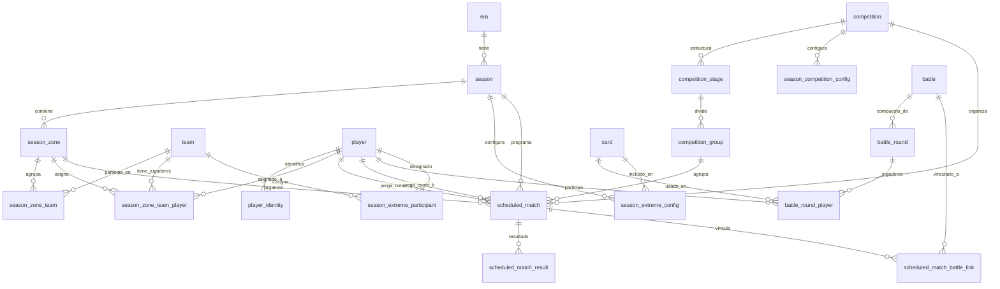

# Database Schema - Liga Admin

## 1. Resumen Ejecutivo

- **Total de tablas identificadas:** 35+
- **Tablas core:** 23
- **Tablas sin definición SQL encontrada:** 12
- **Vistas:** 2
- **Base de datos:** Supabase (PostgreSQL)

### Categorías de tablas

1. **Gestión de Eras y Temporadas** (3): `era`, `season`, `season_zone`
2. **Jugadores y Equipos** (5): `player`, `player_identity`, `team`, `season_zone_team`, `season_zone_team_player`
3. **Competiciones** (4): `competition`, `competition_stage`, `competition_group`, `season_competition_config`
4. **Partidas Programadas** (3): `scheduled_match`, `scheduled_match_result`, `scheduled_match_battle_link`
5. **Batallas y Juego** (4): `battle`, `battle_round`, `battle_round_player`, `card`
6. **Modo Extreme** (2): `season_extreme_config`, `season_extreme_participant`
7. **Otros** (2): `ligakq` (storage), `v_player_current_tag` (vista), `v_active_team_players` (vista)

---

## 2. Diagrama ER (Mermaid)



---

## 3. Tablas Detalladas

### 3.1 Gestión de Eras y Temporadas

#### 3.1.1 `era`

**Propósito:** Agrupar temporadas en épocas/períodos de la liga (ej. "ERA 5", "ERA 6").

**Columnas:**
- `era_id` (UUID, PK): Identificador único
- `description` (VARCHAR): Descripción de la era (ej. "ERA 5")
- `created_at` (TIMESTAMPTZ): Fecha de creación

**Relaciones:**
- 1:N con `season` (una era tiene múltiples temporadas)

**Usado en:**
- [ErasList.jsx](src/pages/admin/ErasList.jsx#L13)
- [EraEdit.jsx](src/pages/admin/EraEdit.jsx#L28)
- [SeasonEdit.jsx](src/pages/admin/SeasonEdit.jsx#L67)

---

#### 3.1.2 `season`

**Propósito:** Temporadas de la liga, cada una contiene zonas, competiciones y partidas.

**Columnas:**
- `season_id` (UUID, PK): Identificador único
- `era_id` (UUID, FK → era): Era a la que pertenece
- `description` (VARCHAR): Descripción (ej. "Temporada 12")
- `status` (VARCHAR): Estado (`DRAFT`, `ACTIVE`, `CLOSED`)
- `duel_start_date` (DATE): Fecha inicio de duelos
- `ladder_start_date` (DATE): Fecha inicio de ladder
- `season_start_at` (TIMESTAMPTZ): Fecha/hora inicio de temporada
- `season_end_at` (TIMESTAMPTZ): Fecha/hora fin de temporada
- `created_at` (TIMESTAMPTZ): Fecha de creación
- `updated_at` (TIMESTAMPTZ): Fecha de última actualización

**Relaciones:**
- N:1 con `era`
- 1:N con `season_zone`
- 1:N con `season_extreme_config`
- 1:N con `scheduled_match`

**Constraints:**
- `status` debe ser `DRAFT`, `ACTIVE` o `CLOSED`
- `season_end_at` >= `season_start_at` (si ambos existen)

**Usado en:**
- [SeasonsList.jsx](src/pages/admin/SeasonsList.jsx#L66)
- [SeasonEdit.jsx](src/pages/admin/SeasonEdit.jsx#L94)
- [SeasonAssignments.jsx](src/pages/admin/SeasonAssignments.jsx#L49)

---

#### 3.1.3 `season_zone`

**Propósito:** Zonas dentro de una temporada (ej. "Zona A", "Zona B", "Zona Gold").

**Columnas:**
- `zone_id` (UUID, PK): Identificador único
- `season_id` (UUID, FK → season): Temporada a la que pertenece
- `name` (VARCHAR): Nombre de la zona
- `zone_order` (INTEGER): Orden de visualización
- `created_at` (TIMESTAMPTZ): Fecha de creación
- `updated_at` (TIMESTAMPTZ): Fecha de última actualización

**Relaciones:**
- N:1 con `season`
- 1:N con `season_zone_team`
- 1:N con `season_zone_team_player`
- 1:N con `scheduled_match`

**Constraints:**
- `UNIQUE(season_id, zone_order)`
- `zone_order >= 1`

**Usado en:**
- [SeasonZones.jsx](src/pages/admin/SeasonZones.jsx#L70)
- [SeasonAssignments.jsx](src/pages/admin/SeasonAssignments.jsx#L73)
- [GroupStandings.jsx](src/pages/admin/GroupStandings.jsx#L155)

---

### 3.2 Jugadores y Equipos

#### 3.2.1 `player`

**Propósito:** Jugadores registrados en la liga.

**Columnas:**
- `player_id` (UUID, PK): Identificador único
- `name` (VARCHAR): Nombre completo del jugador
- `nick` (VARCHAR): Nickname/apodo
- `avatar_url` (VARCHAR): URL del avatar (opcional)
- `photo_url` (VARCHAR): URL de la foto (alternativa)
- `image_url` (VARCHAR): URL de imagen (alternativa)
- `created_at` (TIMESTAMPTZ): Fecha de registro
- `updated_at` (TIMESTAMPTZ): Fecha de última actualización

**Relaciones:**
- 1:N con `player_identity`
- 1:N con `season_zone_team_player`
- 1:N con `scheduled_match` (como player_a o player_b)
- 1:N con `battle_round_player`
- 1:N con `season_extreme_participant`

**Usado en:**
- [PlayersList.jsx](src/pages/admin/PlayersList.jsx#L16)
- [PlayerEdit.jsx](src/pages/admin/PlayerEdit.jsx#L40)
- [BattlesHistory.jsx](src/pages/admin/BattlesHistory.jsx#L151)

---

#### 3.2.2 `player_identity`

**Propósito:** Historial de tags de Clash Royale de cada jugador (permite cambios de tag).

**Columnas:**
- `player_identity_id` (UUID, PK): Identificador único
- `player_id` (UUID, FK → player): Jugador al que pertenece
- `player_tag` (VARCHAR): Tag de Clash Royale (ej. "#2PU82R")
- `valid_from` (TIMESTAMPTZ): Fecha desde la cual el tag es válido
- `valid_to` (TIMESTAMPTZ): Fecha hasta la cual el tag es válido (NULL = actual)
- `created_at` (TIMESTAMPTZ): Fecha de creación

**Relaciones:**
- N:1 con `player`

**Constraints:**
- `player_tag` debe comenzar con "#"
- `UNIQUE(player_tag, valid_from)`
- Solo un tag activo por jugador (`valid_to IS NULL`)
- `valid_to >= valid_from` (si existe)

**Notas:**
- El tag actual de un jugador es el que tiene `valid_to IS NULL`
- Al cambiar el tag, se cierra el anterior (`valid_to = now()`) y se crea uno nuevo

**Usado en:**
- [PlayerEdit.jsx](src/pages/admin/PlayerEdit.jsx#L119)
- Vista `v_player_current_tag`

---

#### 3.2.3 `team`

**Propósito:** Equipos/clanes participantes en la liga.

**Columnas:**
- `team_id` (UUID, PK): Identificador único
- `name` (VARCHAR): Nombre del equipo
- `logo` (VARCHAR): URL del logo del equipo
- `created_at` (TIMESTAMPTZ): Fecha de creación
- `updated_at` (TIMESTAMPTZ): Fecha de última actualización

**Relaciones:**
- 1:N con `season_zone_team`
- 1:N con `season_zone_team_player`
- 1:N con `season_extreme_participant`

**Usado en:**
- [TeamsList.jsx](src/pages/admin/TeamsList.jsx#L32)
- [TeamEdit.jsx](src/pages/admin/TeamEdit.jsx#L46)
- [SeasonAssignments.jsx](src/pages/admin/SeasonAssignments.jsx#L103)

---

#### 3.2.4 `season_zone_team`

**Propósito:** Equipos asignados a cada zona en una temporada.

**Columnas:**
- `season_zone_team_id` (UUID, PK): Identificador único
- `zone_id` (UUID, FK → season_zone): Zona a la que pertenece
- `team_id` (UUID, FK → team): Equipo asignado
- `team_order` (INTEGER): Orden del equipo en la zona
- `created_at` (TIMESTAMPTZ): Fecha de creación
- `updated_at` (TIMESTAMPTZ): Fecha de última actualización

**Relaciones:**
- N:1 con `season_zone`
- N:1 con `team`
- 1:N con `season_zone_team_player`

**Constraints:**
- `UNIQUE(zone_id, team_id)` (un equipo no puede estar duplicado en la misma zona)
- `team_order >= 1`

**Usado en:**
- [SeasonZoneTeams.jsx](src/pages/admin/SeasonZoneTeams.jsx#L81)
- [SeasonAssignments.jsx](src/pages/admin/SeasonAssignments.jsx#L96)

---

#### 3.2.5 `season_zone_team_player`

**Propósito:** Asignación de jugadores a equipos en una zona/temporada (plantilla con fechas de actividad).

**Columnas:**
- `season_zone_team_player_id` (UUID, PK): Identificador único
- `zone_id` (UUID, FK → season_zone): Zona
- `team_id` (UUID, FK → team): Equipo
- `player_id` (UUID, FK → player): Jugador asignado
- `jersey_no` (INTEGER): Número de camiseta (1-99)
- `is_captain` (BOOLEAN): Es capitán del equipo
- `league` (VARCHAR): Liga del jugador (opcional, usado para filtros)
- `ranking_seed` (INTEGER): Semilla de ranking (posición inicial)
- `ranking` (INTEGER): Ranking actual en la zona
- `start_date` (DATE): Fecha de inicio en el equipo
- `end_date` (DATE): Fecha de fin en el equipo (NULL = activo)
- `created_at` (TIMESTAMPTZ): Fecha de creación
- `updated_at` (TIMESTAMPTZ): Fecha de última actualización

**Relaciones:**
- N:1 con `season_zone`
- N:1 con `team`
- N:1 con `player`

**Constraints:**
- ~~`UNIQUE(zone_id, team_id, jersey_no)`~~ **Removido** (permite reutilizar números en reemplazos)
- `jersey_no BETWEEN 1 AND 99` (opcional)
- `ranking_seed >= 1`
- `end_date >= start_date` (si existe)
- Máximo 8 jugadores activos por equipo en una zona a la vez

**Migraciones aplicadas:**
- ✅ `add_player_dates.sql`: Agregó `start_date` y `end_date`
- ✅ `add_ranking_field.sql`: Agregó campo `ranking`
- ✅ `remove_jersey_constraint.sql`: Removió constraint único de jersey_no
- ✅ `update_ranking_seed_constraint.sql`: Cambió límite de ranking_seed
- ✅ `set_player_start_dates.sql`: Asignó fecha inicial a jugadores existentes

**Notas:**
- Permite gestionar reemplazos de jugadores durante la temporada
- Un jugador puede tener múltiples registros en el mismo equipo/zona si fue reemplazado
- Para obtener jugadores activos: `start_date <= HOY AND (end_date IS NULL OR end_date >= HOY)`

**Usado en:**
- [SeasonAssignments.jsx](src/pages/admin/SeasonAssignments.jsx#L145)
- [SeasonZoneRankings.jsx](src/pages/admin/SeasonZoneRankings.jsx#L53)
- [BattlesHistory.jsx](src/pages/admin/BattlesHistory.jsx#L297)

---

### 3.3 Competiciones

#### 3.3.1 `competition`

**Propósito:** Tipos de competiciones/copas (ej. "Copa Oro", "Copa Plata", "Liga Interna").

**Columnas:**
- `competition_id` (UUID, PK): Identificador único
- `name` (VARCHAR): Nombre completo de la competición
- `short_name` (VARCHAR): Nombre corto
- `logo` (VARCHAR): URL del logo
- `created_at` (TIMESTAMPTZ): Fecha de creación
- `updated_at` (TIMESTAMPTZ): Fecha de última actualización

**Relaciones:**
- 1:N con `competition_stage`
- 1:N con `season_competition_config`
- 1:N con `scheduled_match`

**Usado en:**
- [ScheduledMatches.jsx](src/pages/admin/ScheduledMatches.jsx#L427)
- [GroupStandings.jsx](src/pages/admin/GroupStandings.jsx#L177)
- [SeasonCupModes.jsx](src/pages/admin/SeasonCupModes.jsx#L168)

**Tabla sin definición SQL encontrada** (usado en código React)

---

#### 3.3.2 `competition_stage`

**Propósito:** Etapas de una competición (ej. "Qualy", "Grupos", "Semis", "Final").

**Columnas:**
- `competition_stage_id` (UUID, PK): Identificador único
- `competition_id` (UUID, FK → competition): Competición a la que pertenece
- `stage` (VARCHAR): Tipo de etapa (`CUP_QUALY`, `CUP_GROUP`, `CUP_SEMI`, `CUP_FINAL`)
- `stage_order` (INTEGER): Orden de las etapas (1, 2, 3, 4)
- `created_at` (TIMESTAMPTZ): Fecha de creación
- `updated_at` (TIMESTAMPTZ): Fecha de última actualización

**Relaciones:**
- N:1 con `competition`
- 1:N con `competition_group`

**Constraints:**
- `UNIQUE(competition_id, stage)`
- `stage_order >= 1`

**Usado en:**
- [ScheduledMatches.jsx](src/pages/admin/ScheduledMatches.jsx#L273)
- [GroupStandings.jsx](src/pages/admin/GroupStandings.jsx#L198)

**Tabla sin definición SQL encontrada** (usado en código React)

---

#### 3.3.3 `competition_group`

**Propósito:** Grupos dentro de una etapa (ej. "Grupo A", "Grupo B" en fase de grupos).

**Columnas:**
- `competition_group_id` (UUID, PK): Identificador único
- `competition_stage_id` (UUID, FK → competition_stage): Etapa a la que pertenece
- `code` (VARCHAR): Código del grupo (ej. "A", "B", "C")
- `name` (VARCHAR): Nombre descriptivo (ej. "Grupo A")
- `created_at` (TIMESTAMPTZ): Fecha de creación
- `updated_at` (TIMESTAMPTZ): Fecha de última actualización

**Relaciones:**
- N:1 con `competition_stage`
- 1:N con `scheduled_match`

**Constraints:**
- `UNIQUE(competition_stage_id, code)`

**Usado en:**
- [ScheduledMatches.jsx](src/pages/admin/ScheduledMatches.jsx#L297)
- [GroupStandings.jsx](src/pages/admin/GroupStandings.jsx#L227)

**Tabla sin definición SQL encontrada** (usado en código React)

---

#### 3.3.4 `season_competition_config`

**Propósito:** Configuración de modos de juego por temporada, competición y etapa.

**Columnas:**
- `season_competition_config_id` (UUID, PK): Identificador único
- `season_id` (UUID, FK → season): Temporada
- `competition_id` (UUID, FK → competition): Competición
- `stage` (VARCHAR): Etapa (`CUP_QUALY`, `CUP_GROUP`, etc.)
- `api_battle_type` (VARCHAR): Tipo de batalla en API (ej. "riverRaceDuel", "clanMate")
- `api_game_mode` (VARCHAR): Modo de juego en API (ej. "CW_Duel_1v1", "Draft_1v1")
- `best_of` (INTEGER): Mejor de N (3 o 5 rondas)
- `points_schema` (JSONB): Esquema de puntos por resultado (ej. `{"2-0": 4, "2-1": 3}`)
- `updated_at` (TIMESTAMPTZ): Fecha de última actualización
- `created_at` (TIMESTAMPTZ): Fecha de creación

**Relaciones:**
- N:1 con `season`
- N:1 con `competition`

**Constraints:**
- `UNIQUE(season_id, competition_id, stage)`
- `best_of` debe ser 3 o 5
- `points_schema` debe ser un objeto JSON válido

**Ejemplo de `points_schema`:**
```json
{
  "2-0": 4,
  "2-1": 3,
  "1-2": 1,
  "0-2": 0
}
```

**Usado en:**
- [ScheduledMatches.jsx](src/pages/admin/ScheduledMatches.jsx#L707)
- [ScheduledMatchEditModal.jsx](src/components/ScheduledMatchEditModal.jsx#L112)
- [SeasonCupModes.jsx](src/pages/admin/SeasonCupModes.jsx#L177)

**Tabla sin definición SQL encontrada** (usado en código React)

---

### 3.4 Partidas Programadas

#### 3.4.1 `scheduled_match`

**Propósito:** Partidas programadas/agendadas entre jugadores.

**Columnas:**
- `scheduled_match_id` (UUID, PK): Identificador único
- `season_id` (UUID, FK → season): Temporada
- `zone_id` (UUID, FK → season_zone): Zona
- `competition_id` (UUID, FK → competition): Competición
- `competition_stage_id` (UUID, FK → competition_stage): Etapa
- `competition_group_id` (UUID, FK → competition_group): Grupo
- `type` (VARCHAR): Tipo de partida (`CUP_MATCH`, `CW_DAILY`, etc.)
- `stage` (VARCHAR): Etapa (redundante con competition_stage)
- `best_of` (INTEGER): Mejor de N (3 o 5)
- `expected_team_size` (INTEGER): Tamaño esperado del equipo (1 para 1v1)
- `player_a_id` (UUID, FK → player): Jugador A
- `player_b_id` (UUID, FK → player, **NULLABLE**): Jugador B (puede ser NULL para duelos diarios)
- `day_no` (INTEGER): Número de día (para duelos diarios secuenciales)
- `scheduled_from` (TIMESTAMPTZ): Fecha/hora inicio de ventana
- `scheduled_to` (TIMESTAMPTZ): Fecha/hora fin de ventana
- `deadline_at` (TIMESTAMPTZ): Fecha/hora límite para completar
- `status` (VARCHAR): Estado (`PENDING`, `IN_PROGRESS`, `COMPLETED`, `CANCELLED`)
- `score_a` (INTEGER): Puntuación del jugador A (batallas ganadas)
- `score_b` (INTEGER): Puntuación del jugador B (batallas ganadas)
- `result_overridden` (BOOLEAN): Si el resultado fue sobrescrito manualmente
- `created_at` (TIMESTAMPTZ): Fecha de creación
- `updated_at` (TIMESTAMPTZ): Fecha de última actualización

**Relaciones:**
- N:1 con `season`
- N:1 con `season_zone`
- N:1 con `competition`
- N:1 con `competition_stage`
- N:1 con `competition_group`
- N:1 con `player` (player_a_id)
- N:1 con `player` (player_b_id, nullable)
- 1:N con `scheduled_match_result`
- 1:N con `scheduled_match_battle_link`

**Constraints:**
- `best_of` debe ser 3 o 5
- `status` debe ser `PENDING`, `IN_PROGRESS`, `COMPLETED`, `CANCELLED`
- `scheduled_to >= scheduled_from`
- `deadline_at >= scheduled_from`

**Migraciones aplicadas:**
- ✅ `make_player_b_nullable.sql`: `player_b_id` ahora es nullable

**Usado en:**
- [ScheduledMatches.jsx](src/pages/admin/ScheduledMatches.jsx#L472)
- [GroupStandings.jsx](src/pages/admin/GroupStandings.jsx#L255)
- [SeasonsList.jsx](src/pages/admin/SeasonsList.jsx#L230)

**Tabla sin definición SQL encontrada** (usado en código React)

---

#### 3.4.2 `scheduled_match_result`

**Propósito:** Resultados finales de una partida programada.

**Columnas:**
- `scheduled_match_result_id` (UUID, PK): Identificador único
- `scheduled_match_id` (UUID, FK → scheduled_match): Partida relacionada
- `final_score_a` (INTEGER): Puntuación final del jugador A
- `final_score_b` (INTEGER): Puntuación final del jugador B
- `points_a` (INTEGER): Puntos obtenidos por jugador A según `points_schema`
- `points_b` (INTEGER): Puntos obtenidos por jugador B según `points_schema`
- `decided_by` (VARCHAR): Cómo se decidió (`BATTLES`, `ADMIN`, `FORFEIT`)
- `created_at` (TIMESTAMPTZ): Fecha de creación
- `updated_at` (TIMESTAMPTZ): Fecha de última actualización

**Relaciones:**
- 1:1 con `scheduled_match`

**Constraints:**
- `UNIQUE(scheduled_match_id)`

**Migraciones aplicadas:**
- ✅ `add_points_to_result.sql`: Agregó campos `points_a` y `points_b`

**Usado en:**
- [ScheduledMatches.jsx](src/pages/admin/ScheduledMatches.jsx#L673)
- [ScheduledMatchEditModal.jsx](src/components/ScheduledMatchEditModal.jsx#L77)
- [GroupStandings.jsx](src/pages/admin/GroupStandings.jsx#L347)

**Tabla sin definición SQL encontrada** (usado en código React)

---

#### 3.4.3 `scheduled_match_battle_link`

**Propósito:** Vincular partidas programadas con batallas reales jugadas en Clash Royale.

**Columnas:**
- `scheduled_match_battle_link_id` (UUID, PK): Identificador único
- `scheduled_match_id` (UUID, FK → scheduled_match): Partida programada
- `battle_id` (UUID, FK → battle): Batalla real jugada
- `linked_at` (TIMESTAMPTZ): Fecha de vinculación
- `created_at` (TIMESTAMPTZ): Fecha de creación

**Relaciones:**
- N:1 con `scheduled_match`
- N:1 con `battle`

**Constraints:**
- `UNIQUE(battle_id)` (una batalla solo puede estar vinculada a una partida)
- `UNIQUE(scheduled_match_id, battle_id)`

**Usado en:**
- [ScheduledMatches.jsx](src/pages/admin/ScheduledMatches.jsx#L545)
- [ScheduledMatchEditModal.jsx](src/components/ScheduledMatchEditModal.jsx#L122)
- [GroupStandings.jsx](src/pages/admin/GroupStandings.jsx#L443)

**Tabla sin definición SQL encontrada** (usado en código React)

---

### 3.5 Batallas y Juego

#### 3.5.1 `battle`

**Propósito:** Batallas jugadas en Clash Royale (importadas de la API).

**Columnas:**
- `battle_id` (UUID, PK): Identificador único
- `battle_time` (TIMESTAMPTZ): Fecha/hora de la batalla (de la API)
- `type` (VARCHAR): Tipo de batalla (ej. "riverRaceDuel", "clanMate")
- `game_mode` (VARCHAR): Modo de juego (ej. "CW_Duel_1v1", "Draft_1v1")
- `round_count` (INTEGER): Cantidad de rondas en la batalla (1, 3 o 5)
- `raw_payload` (JSONB): Payload completo de la API
- `created_at` (TIMESTAMPTZ): Fecha de importación
- `updated_at` (TIMESTAMPTZ): Fecha de última actualización

**Relaciones:**
- 1:N con `battle_round`
- 1:N con `scheduled_match_battle_link`

**Constraints:**
- `round_count >= 1`

**Usado en:**
- [BattlesHistory.jsx](src/pages/admin/BattlesHistory.jsx#L266)
- [ScheduledMatches.jsx](src/pages/admin/ScheduledMatches.jsx#L734)
- [BattleDetailModal.jsx](src/components/BattleDetailModal.jsx#L104)

**Tabla sin definición SQL encontrada** (usado en código React)

---

#### 3.5.2 `battle_round`

**Propósito:** Rondas individuales de una batalla (una batalla puede tener 1-5 rondas).

**Columnas:**
- `battle_round_id` (UUID, PK): Identificador único
- `battle_id` (UUID, FK → battle): Batalla a la que pertenece
- `round_no` (INTEGER): Número de ronda (1, 2, 3, 4, 5)
- `created_at` (TIMESTAMPTZ): Fecha de creación
- `updated_at` (TIMESTAMPTZ): Fecha de última actualización

**Relaciones:**
- N:1 con `battle`
- 1:N con `battle_round_player`

**Constraints:**
- `UNIQUE(battle_id, round_no)`
- `round_no >= 1`

**Usado en:**
- [BattlesHistory.jsx](src/pages/admin/BattlesHistory.jsx#L322)
- [ScheduledMatches.jsx](src/pages/admin/ScheduledMatches.jsx#L565)
- [BattleDetailModal.jsx](src/components/BattleDetailModal.jsx#L113)

**Tabla sin definición SQL encontrada** (usado en código React)

---

#### 3.5.3 `battle_round_player`

**Propósito:** Participación de jugadores en cada ronda (TEAM vs OPPONENT).

**Columnas:**
- `battle_round_player_id` (UUID, PK): Identificador único
- `battle_round_id` (UUID, FK → battle_round): Ronda
- `player_id` (UUID, FK → player, **NULLABLE**): Jugador (NULL si no está registrado)
- `side` (VARCHAR): Lado (`TEAM`, `OPPONENT`)
- `crowns` (INTEGER): Coronas obtenidas
- `opponent_crowns` (INTEGER): Coronas del oponente (para lado TEAM)
- `opponent` (JSONB): Datos del oponente no registrado (tag, nombre, etc.)
- `deck_cards` (JSONB): Array de 8 card_ids usados en el mazo
- `created_at` (TIMESTAMPTZ): Fecha de creación
- `updated_at` (TIMESTAMPTZ): Fecha de última actualización

**Relaciones:**
- N:1 con `battle_round`
- N:1 con `player` (nullable)
- N:M con `card` (a través de `deck_cards`)

**Constraints:**
- `side` debe ser `TEAM` o `OPPONENT`
- `crowns BETWEEN 0 AND 3`
- `opponent_crowns BETWEEN 0 AND 3`
- `deck_cards` debe contener 8 card_ids

**Notas:**
- Si `player_id IS NULL`, los datos del jugador están en el campo `opponent` (JSONB)
- `deck_cards` es un array JSON de 8 enteros (card_ids)

**Usado en:**
- [BattlesHistory.jsx](src/pages/admin/BattlesHistory.jsx#L310)
- [ScheduledMatches.jsx](src/pages/admin/ScheduledMatches.jsx#L579)
- [BattleDetailModal.jsx](src/components/BattleDetailModal.jsx#L123)

**Tabla sin definición SQL encontrada** (usado en código React)

---

#### 3.5.4 `card`

**Propósito:** Catálogo de cartas de Clash Royale (importadas de la API).

**Columnas:**
- `card_id` (INTEGER, PK): ID de la carta (de la API)
- `name` (VARCHAR): Nombre de la carta
- `raw_payload` (JSONB): Payload completo de la API (incluye iconUrls, maxLevel, etc.)
- `created_at` (TIMESTAMPTZ): Fecha de importación
- `updated_at` (TIMESTAMPTZ): Fecha de última actualización

**Relaciones:**
- N:M con `battle_round_player` (a través de `deck_cards`)
- N:M con `season_extreme_config` (a través de `extreme_deck_cards`)

**Usado en:**
- [BattlesHistory.jsx](src/pages/admin/BattlesHistory.jsx#L480)
- [BattleDetailModal.jsx](src/components/BattleDetailModal.jsx#L153)
- [GroupStandings.jsx](src/pages/admin/GroupStandings.jsx#L519)

**Tabla sin definición SQL encontrada** (usado en código React)

---

### 3.6 Modo Extreme

#### 3.6.1 `season_extreme_config`

**Propósito:** Configuración del mazo Extreme por temporada (24 cartas = 3 mazos de 8).

**Columnas:**
- `season_extreme_config_id` (UUID, PK): Identificador único
- `season_id` (UUID, FK → season): Temporada
- `extreme_deck_cards` (JSONB): Array de 24 card_ids (3 mazos de 8 cartas)
- `created_at` (TIMESTAMPTZ): Fecha de creación
- `updated_at` (TIMESTAMPTZ): Fecha de última actualización

**Relaciones:**
- 1:1 con `season` (una temporada solo puede tener una configuración extreme)

**Constraints:**
- `UNIQUE(season_id)`
- `extreme_deck_cards` debe contener exactamente 24 card_ids

**Triggers:**
- `trigger_update_extreme_config_updated_at`: Actualiza `updated_at` automáticamente

**Usado en:**
- [BattlesHistory.jsx](src/pages/admin/BattlesHistory.jsx#L202)
- [SeasonExtreme.jsx](src/pages/admin/SeasonExtreme.jsx#L213)

**Definición SQL:** [create_extreme_tables.sql](database/create_extreme_tables.sql#L2)

---

#### 3.6.2 `season_extreme_participant`

**Propósito:** Designación de jugadores Extremer y Risky por equipo en una temporada.

**Columnas:**
- `season_extreme_participant_id` (UUID, PK): Identificador único
- `season_id` (UUID, FK → season): Temporada
- `team_id` (UUID, FK → team): Equipo
- `player_id` (UUID, FK → player): Jugador designado
- `participant_type` (VARCHAR): Tipo (`EXTREMER`, `RISKY`)
- `start_date` (DATE): Fecha de inicio de la designación
- `end_date` (DATE, NULLABLE): Fecha de fin (NULL = indefinido)
- `created_at` (TIMESTAMPTZ): Fecha de creación
- `updated_at` (TIMESTAMPTZ): Fecha de última actualización

**Relaciones:**
- N:1 con `season`
- N:1 con `team`
- N:1 con `player`

**Constraints:**
- `UNIQUE(season_id, player_id)` (un jugador no puede ser Extremer y Risky a la vez)
- `participant_type` debe ser `EXTREMER` o `RISKY`
- `end_date >= start_date` (si existe)
- **Regla de negocio:** 1 Extremer por equipo, máximo 2 Risky por equipo

**Triggers:**
- `trigger_update_extreme_participant_updated_at`: Actualiza `updated_at` automáticamente

**Índices:**
- `idx_extreme_participant_season` ON `(season_id)`
- `idx_extreme_participant_team` ON `(team_id)`
- `idx_extreme_participant_player` ON `(player_id)`
- `idx_extreme_participant_type` ON `(participant_type)`
- `idx_extreme_participant_dates` ON `(start_date, end_date)`

**Notas:**
- **Extremer:** Debe usar el mazo Extreme en 2-3 rondas de sus batallas
- **Risky:** Usa un mazo menos restrictivo en 1-2 rondas

**Usado en:**
- [BattlesHistory.jsx](src/pages/admin/BattlesHistory.jsx#L172)
- [SeasonExtreme.jsx](src/pages/admin/SeasonExtreme.jsx#L238)
- [SeasonsList.jsx](src/pages/admin/SeasonsList.jsx#L616)

**Definición SQL:** [create_extreme_tables.sql](database/create_extreme_tables.sql#L14)

---

### 3.7 Vistas

#### 3.7.1 `v_player_current_tag`

**Propósito:** Vista para obtener el tag actual (activo) de cada jugador.

**Definición estimada:**
```sql
CREATE OR REPLACE VIEW v_player_current_tag AS
SELECT 
  player_id,
  player_tag
FROM player_identity
WHERE valid_to IS NULL;
```

**Columnas:**
- `player_id` (UUID): ID del jugador
- `player_tag` (VARCHAR): Tag actual de Clash Royale

**Usado en:**
- [PlayersList.jsx](src/pages/admin/PlayersList.jsx#L33)
- [PlayerEdit.jsx](src/pages/admin/PlayerEdit.jsx#L60)
- [SeasonAssignments.jsx](src/pages/admin/SeasonAssignments.jsx#L128)

**Vista sin definición SQL encontrada** (usado en código React)

---

#### 3.7.2 `v_active_team_players`

**Propósito:** Vista para ver jugadores actualmente activos en equipos (basado en fechas).

**Definición:** [add_player_dates.sql](tools/add_player_dates.sql#L33)

```sql
CREATE OR REPLACE VIEW v_active_team_players AS
SELECT 
  sztp.*,
  p.name as player_name,
  p.nick as player_nick,
  t.name as team_name
FROM season_zone_team_player sztp
JOIN player p ON sztp.player_id = p.player_id
JOIN team t ON sztp.team_id = t.team_id
WHERE (sztp.start_date IS NULL OR sztp.start_date <= CURRENT_DATE)
  AND (sztp.end_date IS NULL OR sztp.end_date >= CURRENT_DATE);
```

**Columnas:**
- Todas las de `season_zone_team_player`
- `player_name` (VARCHAR): Nombre del jugador
- `player_nick` (VARCHAR): Nick del jugador
- `team_name` (VARCHAR): Nombre del equipo

---

### 3.8 Otras Tablas

#### 3.8.1 `ligakq` (Storage Bucket)

**Propósito:** Bucket de almacenamiento de Supabase Storage para archivos multimedia.

**Usado para:**
- Logos de equipos
- Avatares de jugadores
- Otros archivos estáticos

**Políticas RLS requeridas:**
- `INSERT`: authenticated users can upload
- `SELECT`: public can view

**Usado en:**
- [TeamEdit.jsx](src/pages/admin/TeamEdit.jsx#L158) (subida de logos)

---

## 4. Índices y Performance

### 4.1 Índices en Tablas Extreme

```sql
-- season_extreme_participant
CREATE INDEX idx_extreme_participant_season ON season_extreme_participant(season_id);
CREATE INDEX idx_extreme_participant_team ON season_extreme_participant(team_id);
CREATE INDEX idx_extreme_participant_player ON season_extreme_participant(player_id);
CREATE INDEX idx_extreme_participant_type ON season_extreme_participant(participant_type);
CREATE INDEX idx_extreme_participant_dates ON season_extreme_participant(start_date, end_date);
```

### 4.2 Índices en season_zone_team_player

```sql
-- Índice para búsquedas por ranking
CREATE INDEX idx_season_zone_team_player_ranking 
ON season_zone_team_player(zone_id, ranking);
```

### 4.3 Índices Recomendados (no documentados pero probablemente existentes)

```sql
-- Búsquedas frecuentes por temporada/zona
CREATE INDEX idx_season_zone_season ON season_zone(season_id);
CREATE INDEX idx_scheduled_match_season_zone ON scheduled_match(season_id, zone_id);
CREATE INDEX idx_scheduled_match_status ON scheduled_match(status);
CREATE INDEX idx_battle_time ON battle(battle_time DESC);

-- Foreign keys comunes
CREATE INDEX idx_player_identity_player ON player_identity(player_id);
CREATE INDEX idx_season_zone_team_zone ON season_zone_team(zone_id);
CREATE INDEX idx_battle_round_battle ON battle_round(battle_id);
```

---

## 5. Migraciones Aplicadas

### 5.1 Scripts en `database/`

| Archivo | Propósito | Estado |
|---------|-----------|--------|
| `create_extreme_tables.sql` | Crea tablas `season_extreme_config` y `season_extreme_participant` | ✅ Aplicado |
| `add_ranking_field.sql` | Agrega campo `ranking` a `season_zone_team_player` | ✅ Aplicado |
| `add_points_to_result.sql` | Agrega `points_a` y `points_b` a `scheduled_match_result` | ✅ Aplicado |
| `make_player_b_nullable.sql` | Hace `player_b_id` nullable en `scheduled_match` | ✅ Aplicado |
| `update_ranking_seed_constraint.sql` | Actualiza límite de `ranking_seed` | ✅ Aplicado |
| `fix_extreme_rls.sql` | Configura políticas RLS para tablas Extreme | ✅ Aplicado |
| `verify_extreme_tables.sql` | Script de verificación (diagnóstico) | 🔍 Herramienta |
| `extreme_queries.sql` | Consultas de ejemplo para Extreme | 📖 Documentación |
| `test_extreme_insert.sql` | Pruebas de inserción | 🧪 Testing |
| `unlink_player_battles.sql` | Script para desvincular batallas de un jugador | 🔧 Mantenimiento |

### 5.2 Scripts en `tools/`

| Archivo | Propósito | Estado |
|---------|-----------|--------|
| `add_player_dates.sql` | Agrega `start_date` y `end_date` a `season_zone_team_player` | ✅ Aplicado |
| `set_player_start_dates.sql` | Asigna fecha inicial a jugadores existentes | ✅ Aplicado |
| `remove_jersey_constraint.sql` | Remueve constraint único de jersey_no | ✅ Aplicado |
| `apply_player_dates_migration.cjs` | Script Node.js para aplicar migración | 🔧 Herramienta |
| `check_balance.cjs` / `check_balance2.cjs` | Scripts de validación de datos | 🔍 Herramienta |
| `check_lines.cjs` / `count_quotes.cjs` / `print_lines.cjs` | Utilidades de desarrollo | 🔧 Herramienta |

---

## 6. Funciones y Triggers

### 6.1 Funciones Documentadas

#### `update_extreme_updated_at()`

**Propósito:** Actualizar automáticamente el campo `updated_at` en las tablas Extreme.

**Definición:** [create_extreme_tables.sql](database/create_extreme_tables.sql#L47)

```sql
CREATE OR REPLACE FUNCTION update_extreme_updated_at()
RETURNS TRIGGER AS $$
BEGIN
  NEW.updated_at = NOW();
  RETURN NEW;
END;
$$ LANGUAGE plpgsql;
```

**Usado en triggers:**
- `trigger_update_extreme_config_updated_at` ON `season_extreme_config`
- `trigger_update_extreme_participant_updated_at` ON `season_extreme_participant`

---

#### `check_max_active_players()`

**Propósito:** Verificar si un equipo tiene más de 8 jugadores activos en una fecha.

**Definición:** [add_player_dates.sql](tools/add_player_dates.sql#L52)

```sql
CREATE OR REPLACE FUNCTION check_max_active_players(
  p_team_id UUID,
  p_zone_id UUID,
  p_check_date DATE DEFAULT CURRENT_DATE
) RETURNS TABLE (
  active_count INT,
  exceeds_limit BOOLEAN,
  players JSONB
) AS $$
BEGIN
  RETURN QUERY
  SELECT 
    COUNT(*)::INT as active_count,
    COUNT(*) > 8 as exceeds_limit,
    jsonb_agg(
      jsonb_build_object(
        'player_id', sztp.player_id,
        'player_nick', p.nick,
        'player_name', p.name,
        'jersey_no', sztp.jersey_no,
        'start_date', sztp.start_date,
        'end_date', sztp.end_date
      )
    ) as players
  FROM season_zone_team_player sztp
  JOIN player p ON sztp.player_id = p.player_id
  WHERE sztp.team_id = p_team_id
    AND sztp.zone_id = p_zone_id
    AND (sztp.start_date IS NULL OR sztp.start_date <= p_check_date)
    AND (sztp.end_date IS NULL OR sztp.end_date >= p_check_date)
  GROUP BY sztp.team_id, sztp.zone_id;
END;
$$ LANGUAGE plpgsql;
```

**Uso:**
```sql
SELECT * FROM check_max_active_players('team_uuid', 'zone_uuid', '2026-01-24');
```

---

## 7. Reglas de Negocio Importantes

### 7.1 Gestión de Jugadores en Equipos

1. **Máximo 8 jugadores activos** por equipo en una zona a la vez
2. **Jersey numbers:** Ya no son únicos (permite reutilización en reemplazos)
3. **Fechas de actividad:** Se valida con `start_date` y `end_date`
4. **Reemplazos:** Permitidos estableciendo `end_date` en el jugador saliente y creando nuevo registro con el entrante

### 7.2 Modo Extreme

1. **Mazo Extreme:** 24 cartas (3 mazos de 8) por temporada
2. **Extremer:** 1 por equipo, debe usar el mazo en 2-3 rondas
3. **Risky:** Máximo 2 por equipo, mazo menos restrictivo en 1-2 rondas
4. **Exclusividad:** Un jugador no puede ser Extremer y Risky a la vez en la misma temporada

### 7.3 Partidas Programadas

1. **Player B puede ser NULL** (duelos diarios sin oponente asignado)
2. **Resultado automático:** Se calcula desde batallas vinculadas
3. **Override manual:** Permitido con flag `result_overridden`
4. **Puntos:** Se calculan según `points_schema` en la configuración

### 7.4 Tags de Clash Royale

1. **Un tag activo por jugador:** Solo un registro en `player_identity` con `valid_to IS NULL`
2. **Historial completo:** Se mantiene el historial de todos los tags anteriores
3. **Cambio de tag:** Se cierra el anterior y se crea uno nuevo automáticamente

---

## 8. Tablas Adicionales (Sin Definición SQL)

Las siguientes tablas se usan en el código React pero **no se encontró su definición SQL** en el repositorio. Es probable que existan en Supabase pero no se hayan documentado/versionado en archivos SQL:

1. `competition` - Competiciones/copas
2. `competition_stage` - Etapas de competiciones
3. `competition_group` - Grupos dentro de etapas
4. `season_competition_config` - Configuración de modos por competición
5. `scheduled_match` - Partidas programadas (estructura inferida del código)
6. `scheduled_match_result` - Resultados de partidas
7. `scheduled_match_battle_link` - Vinculación de partidas con batallas
8. `battle` - Batallas jugadas
9. `battle_round` - Rondas de batallas
10. `battle_round_player` - Participación en rondas
11. `card` - Catálogo de cartas
12. `v_player_current_tag` - Vista de tags actuales

**Recomendación:** Extraer la estructura de estas tablas directamente desde Supabase Dashboard o mediante:
```sql
SELECT * FROM information_schema.columns 
WHERE table_name IN ('competition', 'scheduled_match', 'battle', 'card', ...)
ORDER BY table_name, ordinal_position;
```

---

## 9. Políticas RLS (Row Level Security)

### 9.1 Tablas Extreme

**Política actual (desarrollo):**
```sql
-- Permitir todo a usuarios autenticados
CREATE POLICY "Allow all for authenticated users" ON season_extreme_config
  FOR ALL USING (auth.role() = 'authenticated');

CREATE POLICY "Allow all for authenticated users" ON season_extreme_participant
  FOR ALL USING (auth.role() = 'authenticated');
```

**Recomendación para producción:**
- Restringir escritura solo a admins
- Permitir lectura a usuarios autenticados
- Considerar políticas por season/zone si se requiere aislamiento

---

## 10. Mejoras Recomendadas

### 10.1 Documentación

1. ✅ Extraer DDL completo de todas las tablas desde Supabase
2. ✅ Documentar foreign keys con nombres explícitos
3. ✅ Agregar diagramas ER más detallados por módulo
4. ✅ Documentar enums/constraints de valores permitidos

### 10.2 Estructura

1. 🔄 Considerar separar tablas core de configuración en schemas distintos
2. 🔄 Agregar `soft deletes` con `deleted_at` en lugar de borrado físico
3. 🔄 Implementar auditoría completa con `created_by` y `updated_by`

### 10.3 Performance

1. 🔄 Revisar índices faltantes en tablas sin definición SQL
2. 🔄 Considerar índices parciales para queries frecuentes (ej. `WHERE status = 'ACTIVE'`)
3. 🔄 Evaluar particionamiento de `battle` por fecha si crece mucho

### 10.4 Integridad

1. 🔄 Agregar checks de integridad referencial en client-side antes de borrados
2. 🔄 Implementar validaciones de reglas de negocio en triggers/functions
3. 🔄 Considerar constraints CHECK adicionales para datos críticos

---

## 11. Referencias

- **Código fuente:** `src/pages/admin/` (archivos .jsx)
- **Migraciones SQL:** `database/` y `tools/`
- **Documentación relacionada:**
  - [EXTREME_VALIDATION_README.md](EXTREME_VALIDATION_README.md)
  - [PLAYER_DATES_README.md](PLAYER_DATES_README.md)
  - [RANKINGS_README.md](RANKINGS_README.md)
  - [database/EXTREME_README.md](database/EXTREME_README.md)

---

**Documento generado el:** 2026-01-24  
**Versión:** 1.0  
**Basado en análisis de código real del proyecto Liga Admin**
